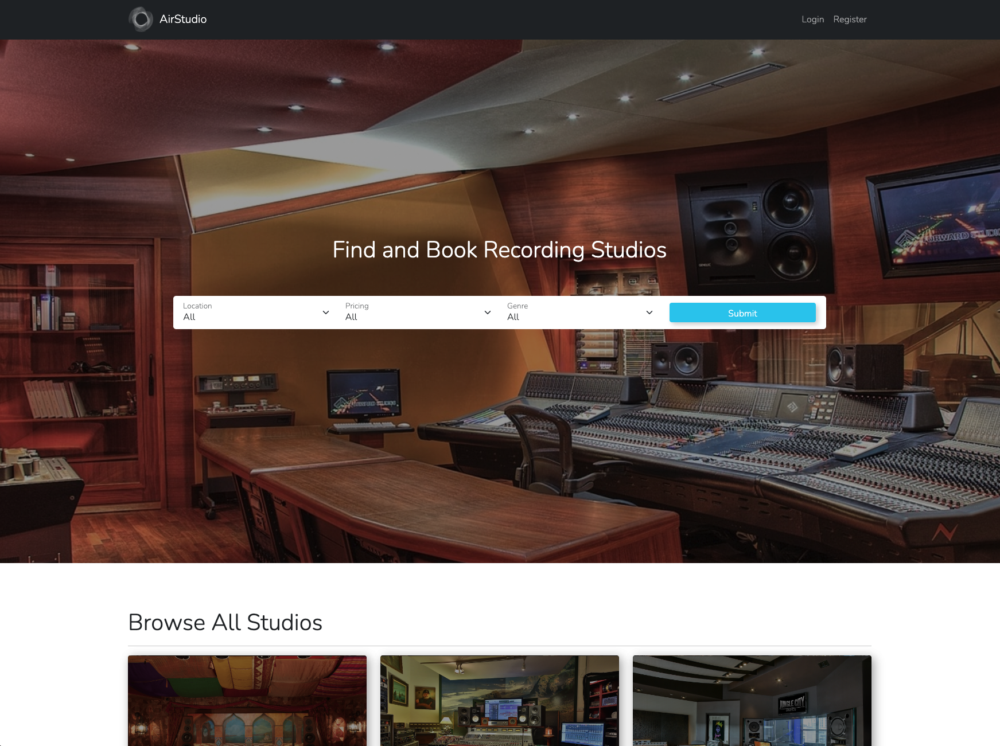

# AirStudio



## Project Overview

AirStudio was my third project for General Assembly’s Software Engineering Course. It was built using the MERN stack over 8 days, with Harry Evans and Eoin Barr.

The concept for our project was an Airbnb clone with a twist - a place where users could peruse, book, review and upload recording studios.

It is deployed using Heroku/Netlify and is available [here](https://airstudio-se57.netlify.app/).

## Brief

* Build a full-stack application by making your own backend and your own front-end.
* Use an Express API to serve your data from a Mongo database.
* Consume your API with a separate front-end built with React.
* Be a complete product, which most likely means multiple relationships and CRUD functionality for at least a couple of models.
* Implement thoughtful user stories/wireframes that are significant enough to help you know which features are core MVP and which you can cut.
* Have a visually impressive design.
* Be deployed online so it's publicly accessible.


## Technologies Used

* Node.js
* Express.js
* MongoDB
* Mongoose
* React.js
* JavaScript
* HTTP5
* SCSS
* Bootstrap-React
* Bootstrap
* Axios
* React-Geocode
* React-Datepicker
* React-Calendar
* React-Select

## Process

We arrived at the idea of doing an Airbnb clone fairly quickly - we knew we wanted this project to be bigger in scope than our previous ones, and the Airbnb model allows for lots of different relationships between models and interesting functionality. 

We built the backend as a team, having one person screen-share with the rest and swapping around every few hours. Although this felt laborious at the time, it meant that we were all familiar with every inch of the backend and were able to spot errors in the code remarkably quickly with three sets of eyes. We also knew there was some real complexity there, and wanted to nail it down definitively before we started work on the frontend. Despite our best efforts, all three of us would go back to edit the backend at various times during the project!

When setting up the schema for our studios, we wanted it to be as realistic as possible. Our studio schema had almost forty data fields and in hindsight, we should have streamlined this - it meant seeding our data was very time-consuming and left us with very complex forms to create! 

The lengthy schema in question:
```javascript
const studioSchema = new mongoose.Schema({
  name: { type: String, required: true, unique: true },
  description: [{ type: String, required: true }],
  mainImage: { type: String, required: true },
  altImageOne: { type: String, require: false },
  altImageTwo: { type: String, require: false }, 
  altImageThree: { type: String, require: false }, 
  location: {
    addressLineOne: { type: String, required: true },
    addressLineTwo: { type: String, required: false },
    postCode: { type: String, required: true },
    town: { type: String, required: true },
    country: { type: String, required: true },
    continent: { type: String, required: true },
    longitude: { type: Number, required: true },
    latitude: { type: Number, required: true },
  },
  size: { type: Number, required: true, min: 1, max: 3 },
  equipment: {
    guitars: { type: Boolean, required: true },
    drums: { type: Boolean, required: true },
    synthesizers: { type: Boolean, required: true },
    microphones: { type: Boolean, required: true },
    mixingDesk: { type: Boolean, required: true },
  },
  rate: { type: Number, required: true, min: 1, max: 3 },
  accommodation: { type: Boolean, required: true },
  noOfStudios: { type: Number, required: true, min: 1 },
  genres: [{ type: String, required: true }],
  previousClientsOne: {
    name: { type: String, required: false },
    image: { type: String, required: false },
  },
  previousClientsTwo: {
    name: { type: String, required: false },
    image: { type: String, required: false },
  },
  previousClientsThree: {
    name: { type: String, required: false },
    image: { type: String, required: false },
  },
  availability: [{ type: String, required: false }],
  bookings: [bookingSchema],
  addedBy: { type: mongoose.Schema.ObjectId, ref: 'User', required: true },
  favouritedBy: [{ type: mongoose.Schema.ObjectId, ref: 'User', required: true }],
  comments: [commentSchema],
})
```


Once we were satisfied and all the different routes had been tested in Insomnia, we moved onto the frontend.

We chose to use Bootstrap and React-Bootstrap in the hope that we would be able to get going quickly and hit the ground running. On balance, we achieved this, but having never used Bootstrap before there was more of a learning curve than we had initially appreciated.

We divvied up the labour fairly informally and in hindsight perhaps we should have taken a more structured approach. I initially volunteered to get going on our forms to add and update studios - little did I know this would take me days.

I think it’s fair to say I had completely underestimated the task - we’d had a little experience at building forms by this point, but nothing on this scale. Even the idea of React using controlled components felt alien and counterintuitive to me. After some time spent with the React documentation, I felt much better and things started to flow a lot easier.

I used React-Select to create a multi-select box - this saved me hours of work, as I’d initially assumed I’d have to code something bespoke myself.

```javascript
{formData &&
  <Form.Group className="mb-3">
    <Form.Label>Genre Speciality</Form.Label>
    <Select
      options={genreSelectOptions}
      isMulti
      onChange={selected =>
        handleMultiSelectChange(selected, 'genres')}
      value={formData.genres.map(item =>
        ({ label: item[0].toUpperCase() + item.substring(1), value: item }))}
    />
  </Form.Group>
```


In order to display our studios on a map, I had to find a way to get the location data when users add a studio. As a placeholder I had a field for latitude and longitude - but this wasn’t a serious solution. I managed to find a plugin that used a Google API to grab latitude and longitude based on postcode, which I then adapted to use in my form.

```javascript
​​ const findLatLong = () => {
    Geocode.fromAddress(formData.location.postCode).then(
      async (response) => {
        const { lat, lng } = response.results[0].geometry.location
        setFormData({ ...formData, location: { ...formData.location, latitude: lng, longitude: lat } })
        console.log(lat, lng)
      },
      (error) => {
        console.error(error)
      }
    )
  }
```


Initially, this would run when the user submits the form. However I could never get the longitude and latitude returned in state quickly enough - it would just return null and the form would return an error. I solved this by using the onBlur event - the latitude and longitude are worked out immediately after the user has typed the postcode and moved on to the next stage of the form.

With the forms behind me, I spent the remainder of my time tidying up the styling of the site - making things more uniform between components and making sure features worked as intended.

## Challenges

I spent a considerable amount of time on our edit form, trying to retrieve information from arrays in our studio object. I eventually had to go and change our backend structure so a few of the fields were split from arrays into separate fields. I fixed the issue - but I’m pretty sure it was completely achievable as it was, given some more time and a better understanding!

This project was also the first time any of us had used Git in a group context. For the most part we tried to keep our code separate and avoid merge conflicts, but this wasn’t always possible or desirable. We definitely suffered a few teething problems as we got used to the learning curve of merging our code.

## Wins

I was really proud to have gotten a non-intrusive way of getting location data from the user. We strived to create a modern looking and feeling site, and felt like asking the user to input this information manually would completely ruin that impression.

## Future Content and Improvements

Overhaul our booking system to function properly. Currently, there is no restriction on bookings - the user can make as many as they want at any venue, regardless of availability or capacity. 
Implement payment processing - or at least attempt a believable fake!

## Key Learnings

This project was by far the most challenging on the course for me, bringing together a lot of new ideas and then having to build on top of them. There were some fundamental react concepts to do with state and controlled inputs that I really had to get my head around in order to move forward. However, this provided a solid foundation to build upon and would pay dividends when planning my next project.
